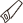
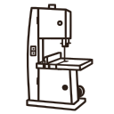

 # Symbol Übersicht

Hier findest du eine Übersicht über die verschiedenen Symbole, die in diesem Projekt verwendet werden, sowie deren Bedeutung.

# Symbole Werkzeuge

## 🧰 Handwerkzeuge

| Nr. | Icon | Deutsch | Dateiname |
|----:|------|----------|-----------|
| 1 |  | Handsäge | handsaw.svg |
| 2 |  | Japansäge | japanese_saw.svg |
| 3 |  | Hobel | hand_plane.svg |
| 4 |  | Stechbeitel | chisel.svg |
| 5 |  | Klüpfel | mallet.svg |
| 6 |  | Hammer | hammer.svg |
| 7 |  | Holzhammer | wooden_mallet.svg |
| 8 |  | Schraubendreher | screwdriver.svg |
| 9 |  | Kneifzange | pincers.svg |
| 10 |  | Kombizange | combination_pliers.svg |
| 11 |  | Cuttermesser | utility_knife.svg |
| 12 |  | Pinsel | paintbrush.svg |
| 13 |  | Winkelmesser | square_ruler.svg |
| 14 |  | Streichmaß | marking_gauge.svg |
| 39 |  | Streichmaß (alt) | marking_gauge_alt.svg |
| 40 |  | Bleistift | pencil.svg |
| 41 |  | Schieblehre | caliper.svg |
| 42 |  | Wasserwaage | spirit_level.svg |
| 37 |  | Maßband | tape_measure.svg |
| 38 |  | Zollstock | folding_ruler.svg |
| 15 |  | Schraubzwinge | clamp.svg |
| 50 |  | Leimzwinge | glue_clamp.svg |

---

## 🔌 Elektro‑Werkzeuge

| Nr. | Icon | Deutsch | Dateiname |
|----:|------|----------|-----------|
| 16 |  | Akkuschrauber | cordless_drill.svg |
| 17 |  | Bohrmaschine | drill.svg |
| 18 |  | Oberfräse | router.svg |
| 19 |  | Exzenterschleifer | orbital_sander.svg |
| 20 |  | Bandschleifer | belt_sander.svg |
| 21 |  | Stichsäge | jigsaw.svg |
| 22 |  | Handkreissäge | circular_saw.svg |
| 33 |  | Heißluftföhn | heat_gun.svg |
| 35 |  | Nagelpistole | nail_gun.svg |
| 36 |  | Lackierpistole | spray_gun.svg |

---

## 🏭 Stationäre Maschinen

| Nr. | Icon | Deutsch | Dateiname |
|----:|------|----------|-----------|
| 23 |  | Tischkreissäge | table_saw.svg |
| 24 |  | Abrichte | jointer.svg |
| 25 |  | Bandsäge | band_saw.svg |
| 26 |  | Dekupiersäge | scroll_saw.svg |
| 27 |  | Kappsäge | miter_saw.svg |
| 28 |  | Frästisch | router_table.svg |
| 29 |  | Schleifbock | bench_grinder.svg |
| 30 |  | Standbohrmaschine | drill_press.svg |
| 34 |  | Kompressor | compressor.svg |
| 32 |  | Absaugung | dust_extraction.svg |
| 31 |  | Staubsauger | vacuum_cleaner.svg |

---

## 🧩 Zubehör & Verbrauchsmaterial

| Nr. | Icon | Deutsch | Dateiname |
|----:|------|----------|-----------|
| 43 |  | Holzleim | wood_glue.svg |
| 44 |  | Farbeimer | paint_bucket.svg |
| 45 |  | Klebeband | masking_tape.svg |
| 46 |  | Schraube | screw.svg |
| 47 |  | Holzschraube | wood_screw.svg |
| 48 |  | Dübel | dowel.svg |
| 49 |  | Nagel | nail.svg |

---

## 🪵 Material & Werkstatt

| Nr. | Icon | Deutsch | Dateiname |
|----:|------|----------|-----------|
| 51 |  | Holzbrett | wooden_board.svg |
| 52 |  | Balken | beam.svg |
| 53 |  | Holzstapel | lumber_stack.svg |
| 54 |  | Werkbank | workbench.svg |
| 55 |  | Schraubstock | vise.svg |
| 56 |  | Holzbock | sawhorse.svg |

---

## 🔧 Arbeitsschritte / Tätigkeiten

| Nr. | Icon | Deutsch | Dateiname |
|----:|------|----------|-----------|
| 57 |  | Sägen | sawing.svg |
| 58 |  | Hobeln | planing.svg |
| 59 |  | Schleifen | sanding.svg |
| 60 |  | Bohren | drilling.svg |
| 61 |  | Fräsen | routing.svg |
| 62 |  | Verleimen | gluing.svg |
| 63 |  | Messen | measuring.svg |
| 64 |  | Montieren | assembling.svg |
