# Icons

| Icon | Dateiname | Bezeichnung | Beschreibung |
|------|-----------|-------------|--------------|
|  | `saws.png` | Sägen | Werkzeuge zum Trennen von Holz |
|  | `plane.png` | Hobel | Handhobel zum Glätten und Formen von Holzoberflächen |
| 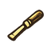 | `chisels.png` | Stechbeitel | Zum Ausstemmen und Nacharbeiten von Holz |
|  | `drills.png` | Akkuschrauber | Zum Herstellen von Löchern |
| 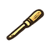 | `knives.png` | Messer | Zum Schneiden und Zuschneiden |
| 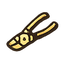 | `pliers.png` | Zangen | Zum Greifen, Biegen, Halten, Schneiden |
|  | `sanding-block.png` | Schleifblock | Zum Schleifen von Oberflächen |
| 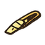 | `cutters.png` | Schneider / Trennwerkzeuge | Zum Trennen von Material |
|  | `square.png` | Anschlagwinkel | Zum Prüfen und Anzeichnen von 90°-Winkeln |
|  | `tape.png` | Maßband | Flexibles Messwerkzeug |
| 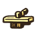 | `clamps.png` | Zwingen | Zum Spannen und Fixieren von Werkstücken |
| 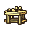 | `workbench.png` | Werkbank | Stabile Arbeitsfläche |
| 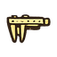 | `calipers.png` | Messschieber | Präzisionsmessgerät für Innen-/Außenmaße |
|  | `stool.png` | Hocker | Runder Sitzhocker |
|  | `tablesaws.png` | Tischkreissägen | Stationäre Säge mit Tisch |
|  | `orbital-sander.png` | Schwingschleifer | Zum Schleifen und Glätten von Holzoberflächen |
|  | `routers.png` | Fräsen | Zum Profilieren und Kantenbearbeiten |
|  | `sanders.png` | Schleifmaschinen | Zum Schleifen, Entgraten, Trennen |
|  | `jigsaw.png` | Stichsäge | Zum Sägen von Kurven und Ausschnitten |
| 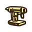 | `drillpress.png` | Ständerbohrmaschine | Zum präzisen Bohren von Löchern |
| 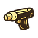 | `heatgun.png` | Heißluftpistole | Zum Erwärmen, Formen und Entfernen von Lacken |
|  | `screws.png` | Schrauben | Verbindungselemente mit Gewinde |
| 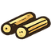 | `dowel.png` | Holzdübel | Verbindungselemente aus Holz |
| 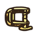 | `cclamp.png` | Schraubzwinge | Weitere Spann-/Fixierwerkzeuge |
| 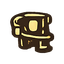 | `paint.png` | Farbtopf | Behälter für Farbe oder Lack |
| 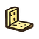 | `bracket.png` | Winkelverbinder | Metallwinkel zur Verbindung von zwei Bauteilen |
| 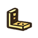 | `joint.png` | Eckverbindung | Eine Eckverbindung |
| 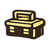 | `toolbox.png` | Werkzeugkiste | Tragbare Aufbewahrung für Werkzeuge |
| 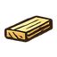 | `lumber.png` | Schnittholz | Bretter, Kanthölzer, Balken |
| 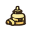 | `gluebottle.png` | Leimflasche | Dosierflasche für Holzleim |
|  | `cclamp2.png` | Schraubzwinge (groß) | Weitere Spann-/Fixierwerkzeuge |
|  | `hearing-protection.png` | Gehörschutz | Schutz vor Lärm |
| 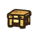 | `storage.png` | Lager / Aufbewahrung | Regale, Schränke, Boxen |
|  | `goggles.png` | Schutzbrille | Augenschutz bei der Arbeit |
| 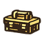 | `toolbox2.png` | Werkzeugkoffer | Robuste, tragbare Aufbewahrung für Werkzeuge |
| 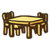 | `dining-table.png` | Esstisch | Rechteckiger Tisch mit vier Beinen |
|  | `sofa.png` | Sofa | ZweisitzerSofa mit Polstern |
| 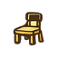 | `chair.png` | Stuhl | Klassischer Holzstuhl |
|  | `stool.png` | Hocker | Kleiner Sitzhocker |
| 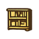 | `shelf.png` | Regal | Offenes Standregal mit mehreren Fächern |
| 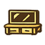 | `tv-stand.png` | TV-Board | Niedriges Medienmöbel mit Ablagen |
|  | `mirror.png` | Spiegel | Wandspiegel mit Rahmen |
| 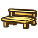 | `garden-bench.png` | Gartenbank | Outdoor Sitzbank |
|  | `birdhouse.png` | Vogelhaus | Kleines Häuschen für Vögel |
| 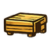 | `solid_block.png` | Massivholzblock | Ein kompakter Holzklotz oder ein geschlossener Korpus. |
| 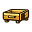 | `drawer_component.png` | Schubladenfach | Einzelne Komponente für ein Aufbewahrungsmöbel. |
| 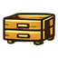 | `mini_chest.png` | Kleinkommode | Fertiges Projekt mit zwei Schubladenelementen. |
|  | `board_set.png` | Doppelplanke | Zwei passgenau zugeschnittene Bretter. |
| 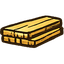 | `wood_stack.png` | Plattenstapel | Mehrere übereinandergelagerte Schichtholzplatten. |
|  | `l_profile.png` | L-Profil | Ein im rechten Winkel verleimtes oder geschnittenes Profil. |
| 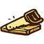 | `rough_cut.png` | Rohzuschnitt | Ein Bauteil während der Trennung vom Rohmaterial. |
|  | `recessed_wood.png` | Aussparung | Werkstück mit einer eingebrachten Nut oder Vertiefung. |
| 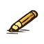 | `marking.png` | Anzeichnung | Holzstück mit Markierungen für Bohrungen oder Schnitte. |
| 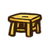 | `wooden_stool.png` | Werkstatthocker | Klassisches dreibeiniges Projekt aus Vollholz. |
| 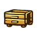 | `cabinet_unit.png` | Schrankelement | Ein geschlossener Möbelkorpus mit zwei Fronten. |
| 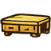 | `lowboard.png` | TV-Möbel / Lowboard | Ein breites, flaches Möbelstück als Endergebnis. |
|  | `frame_corner.png` | Rahmenkonstruktion | Detail einer stabilen Eckverbindung für Rahmen. |
|  | `dimensioning.png` | Maßkontrolle | Ein Werkstück, dessen Maße gerade definiert wurden. |
|  | `bench_assembly.png` | Werkbank-Modul | Teil einer robusten Arbeitsstation. |
|  | `hardware_tray.png` | Kleinteile-Tablett | Ablage für Holzdübel, Kugeln oder Stopfen. |
| 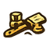 | `joint_assembly.png` | Steckverbindung | Das Zusammenfügen von Zapfen und Schlitz. |
| 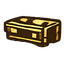 | `wood_trunk.png` | Holztruhe | Ein Projekt mit aufklappbarem Deckel. |
|  | `sanding_process.png` | Oberflächenschliff | Ein Bauteil während der Glättung der Oberfläche. |
|  | `moulding.png` | Zierprofil | Holz mit einer profilierten, dekorativen Kante. |
| 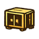 | `high_cabinet.png` | Hochschrank | Ein großes, zweitüriges Möbelprojekt. |
| 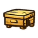 | `storage_box.png` | Lagerbox | Eine einfache, oben offene Holzkiste. |
|  | `surface_finish.png` | Finish | Darstellung einer behandelten (geölten/lackierten) Fläche. |
|  | `hardware_set.png` | Eisenwaren | Verschiedene Verbindungsmittel wie Bolzen und Schrauben. |
| 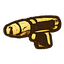 | `drilled_hole.png` | Bohrpunkt | Ein Werkstück mit einem präzisen Loch für Dübel. |
| 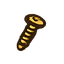 | `wood_screw.png` | Holzschraube | Einzelne Komponente zur mechanischen Befestigung. |
| 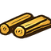 | `dowels.png` | Verbindungsdübel | Rundhölzer für die unsichtbare Stabilisierung. |
|  | `trestle.png` | Unterbock | Ein tragendes Gestell für Arbeitsplatten oder Tische. |
|  | `jig_piece.png` | Schablonenbauteil | Ein speziell geformtes Teil für wiederkehrende Schnitte. |
|  | `glue_up.png` | Verleimung | Zwei Komponenten während des Abbindevorgangs. |
|  | `compressed_joint.png` | Pressverbindung | Verbindung, die unter permanentem Druck steht. |
| 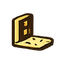 | `angle_bracket.png` | Montagewinkel | Ein Bauteil zur Verstärkung von Eckverbindungen. |
| 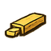 | `tenon_joint.png` | Zapfenverbindung | Klassische Verbindung aus einem abgesetzten Zapfen und Schlitz. |
| 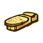 | `oval_tenon.png` | Ovalzapfen | Moderne Verbindung mit abgerundetem Zapfenprofil (z. B. Domino). |
| 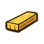 | `wood_plank.png` | Holzdiele | Einzelnes, sauber zugeschnittenes Brett als Basismaterial. |
| 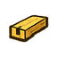 | `dado_groove.png` | Nutprofil | Brett mit einer eingefrästen Längsnut zur Aufnahme von Böden. |
| 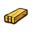 | `tongue_groove.png` | Federprofil | Gegenstück zur Nut für bündige Flächenverbindungen. |
| 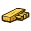 | `lap_joint.png` | Überplattung | Verbindung, bei der beide Hölzer auf halbe Stärke ausgeklinkt sind. |
| 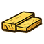 | `butt_joint.png` | Stumpfstoß | Einfaches Aneinanderfügen zweier Bretter an den Kanten. |
| 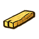 | `notched_joint.png` | Kerbverbindung | Bauteil mit einer Aussparung für querlaufende Hölzer. |
| 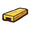 | `u_profile.png` | U-Profil | Holzbauteil mit einer durchgehenden, U-förmigen Ausfräsung. |
|  | `t_joint.png` | T-Verbindung | Senkrechtes Aufsetzen eines Brettes auf eine Fläche. |
|  | `corner_lap.png` | Eck-Überplattung | Überkreuzte Eckverbindung durch gegenseitiges Ausklinken. |
|  | `cross_lap.png` | Kreuzüberplattung | Verbindung von zwei sich schneidenden Hölzern auf einer Ebene. |
|  | `mortise_block.png` | Zapfenloch-Block | Werkstück mit einer vorbereiteten rechteckigen Öffnung. |
|  | `halving_joint.png` | Halbhölzer | Zwei Hölzer, die für eine Eckverbindung abgesetzt wurden. |
|  | `plywood_stack.png` | Schichtholz-Detail | Darstellung von mehreren verleimten Holzlagen. |
|  | `board_stack.png` | Bretterstapel | Übereinander gelagerte Holzlatten für die Fertigung. |
|  | `dovetail.png` | Schwalbenschwanz | Formschlüssige, dekorative Eckverbindung für Korpusse. |
|  | `slotted_joint.png` | Schlitzverbindung | Vertikaler Einschnitt am Ende eines Holzes (Gegenstück zum Zapfen). |
|  | `triple_layer.png` | Dreifachschicht | Verbindung aus drei versetzt verleimten Ebenen. |
|  | `flat_component.png` | Flachbauteil | Eine dünne, bearbeitete Holzplatte. |
