 # Symbol Übersicht

Hier findest du eine Übersicht über alle Symbole, die in diesem Projekt verwendet werden, sowie deren Bedeutung.

## 📋 Alle verfügbaren Symbole

### 🧰 Handwerkzeuge

| Icon | Deutsch | Dateiname |
|------|----------|-----------|
| 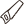 | Handsäge | handsaw.svg |
| 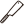 | Japansäge | japanese_saw.svg |
|  | Schnitzwerkzeug | carving_knife.svg |
|  | Hobel | hand_plane.svg |
|  | Stechbeitel | chisel.svg |
| 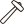 | Klüpfel | mallet.svg |
|  | Hammer | hammer.svg |
|  | Holzhammer | wooden_mallet.svg |
|  | Schraubendreher | screwdriver.svg |
|  | Kneifzange | pincers.svg |
| 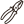 | Kombizange | combination_pliers.svg |
| 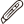 | Cuttermesser | utility_knife.svg |
|  | Pinsel | paintbrush.svg |
|  | Farbrolle | paint_roller.svg |
| 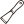 | Spachtel | putty_knife.svg |
|  | Feile | file.svg |
|  | Winkelmesser | square_ruler.svg |
| 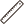 | Streichmaß | marking_gauge.svg |
| 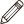 | Bleistift | pencil.svg |
|  | Schieblehre | caliper.svg |
|  | Wasserwaage | spirit_level.svg |
|  | Maßband | tape_measure.svg |
|  | Zollstock | folding_ruler.svg |

### 🔨 Spannwerkzeuge

| Icon | Deutsch | Dateiname |
|------|----------|-----------|
| 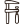 | Schraubzwinge | clamp.svg |
| 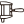 | Leimzwinge | glue_clamp.svg |
|  | Eckzwinge | corner_clamp.svg |
|  | Schraubstock | vise.svg |

### 🔌 Elektro-Handwerkzeuge

| Icon | Deutsch | Dateiname |
|------|----------|-----------|
|  | Akkuschrauber | cordless_drill.svg |
|  | Bohrmaschine | drill.svg |
| 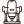 | Oberfräse | router.svg |
|  | Exzenterschleifer | orbital_sander.svg |
|  | Bandschleifer | belt_sander.svg |
|  | Stichsäge | jigsaw.svg |
|  | Handkreissäge | circular_saw.svg |
|  | Heißluftföhn | heat_gun.svg |
|  | Nagelpistole | nail_gun.svg |
| 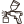 | Lackierpistole | spray_gun.svg |

### 🏭 Stationäre Maschinen

| Icon | Deutsch | Dateiname |
|------|----------|-----------|
|  | Tischkreissäge | table_saw.svg |
|  | Kappsäge | miter_saw.svg |
|  | Bandsäge | band_saw.svg |
|  | Dickenhobel | planer.svg |
|  | Abrichte | jointer.svg |
|  | Drehmaschine | lathe.svg |
|  | Frästisch | router_table.svg |
| 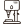 | Standbohrmaschine | drill_press.svg |
|  | Schleifbock | bench_grinder.svg |
|  | Kompressor | compressor.svg |
|  | Absauganlage | dust_extraction.svg |
|  | Staubsauger | vacuum_cleaner.svg |

### 🧩 Zubehör & Verbrauchsmaterial

| Icon | Deutsch | Dateiname |
|------|----------|-----------|
|  | Holzleim | wood_glue.svg |
|  | Möbelöl | furniture_oil.svg |
|  | Möbellack | furniture_varnish.svg |
|  | Farbeimer | paint_bucket.svg |
|  | Klebeband | masking_tape.svg |
|  | Schleifpapierrolle | sandpaper_roll.svg |
|  | Schraube | screw.svg |
| 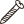 | Holzschraube | wood_screw.svg |
| 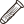 | Dübel | dowel.svg |
| 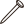 | Nagel | nail.svg |
|  | Forstnerbohrerset | forstner_bit_set.svg |
| 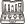 | Fräserset | router_bit_set.svg |
|  | Drechselmeissel | turning_chisels.svg |
|  | Spannzange | collet.svg |
|  | Lamelloverbindung | lamello.svg |

### 🪵 Material & Werkstatt

| Icon | Deutsch | Dateiname |
|------|----------|-----------|
|  | Holzbrett | wooden_board.svg |
|  | Balken | beam.svg |
|  | Holzstapel | lumber_stack.svg |
|  | Rahmen | frame.svg |
|  | Werkbank | workbench.svg |
|  | Holzbock | sawhorse.svg |
|  | Multifunktionstisch | multi_table.svg |
|  | Werkzeugwagen | tool_cart.svg |
|  | Schublade | drawer.svg |
|  | Knopf | knob.svg |
|  | Griff | handle.svg |
|  | Topfband | cup_hinge.svg |
| 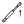 | Dämpfer | damper.svg |
|  | Liste | list.svg |
|  | Stuhl | chair.svg |

### 🛡️ Persönliche Schutzausrüstung

| Icon | Deutsch | Dateiname |
|------|----------|-----------|
|  | Staubmaske | dust_mask.svg |
|  | Gehörschutz | hearing_protection.svg |
|  | Sicherheitsschuhe | safety_shoes.svg |

---

Insgesamt: **87 Symbole**
